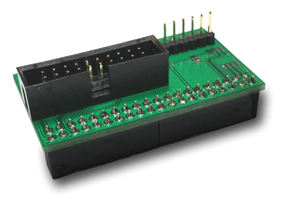

# neorv32-examples

Some neorv32 examples for Intel FPGA boards using Quartus II and SEGGER Embedded Studio for RISC-V.

For the easier use of JTAG and a FTDI UART adapter there is now the "JTAG Terasic Adapter" available:

A [Schematic](./doc/fpgajtag.pdf "Schematic") and the [Gerber](./doc/fpgajtag.zip "Gerber") files are also available.
